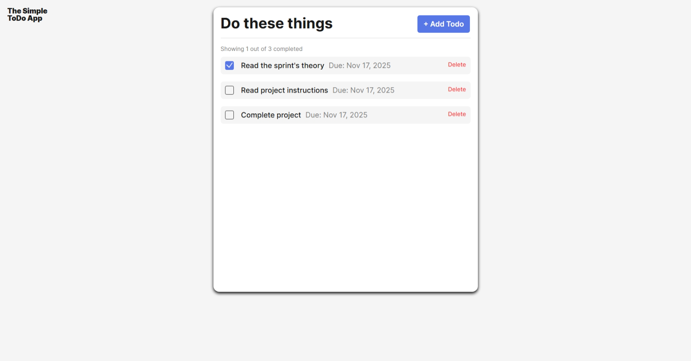

todo-app

Hello my name is Reggie Robinson,

Therefore I will explained the project I had been working on which is todo-app project. However with this project I have to make sure that I am taking my time and writing my codes like they wanted me to write a certain code to make it work and my live project show and funtion at the same time. Therefore when it comes to creating a project you have to know what languages you will used for in this project I have used alot of java scripts because that what language they wanted me to used to make my project standout and function. However with todo-app project I also have to make sure that the spelling is right and the checkboxes works when I click on it and delete it after I check it or un check it.

## Functionality

Give a more detailed explanation of the project and its functionality.

## Technology

Therefore this picture show the live project screenshot of it and also the name of the project is called todo-app and it basically do with making a todo page list you can add or delete a step that you have already completed.

## Deployment

This project is deployed on GitHub Pages:

- ADD LINK HERE
  https://github.com/Reggiero31/se_project_todo-app

  sprint 8 video todo-app project

  https://www.loom.com/share/310365ef5aba447f8fdc2cc06aebd1f2

sprint 8 Live project
http://127.0.0.1:5500/
